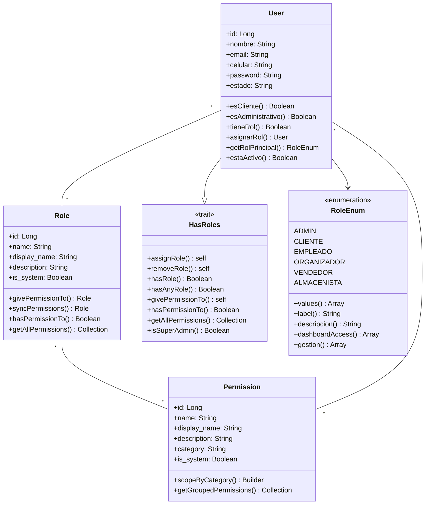

# 🛡️ Sistema RBAC - Roles y Permisos

## 📊 Diagrama de Clases



## 🏗️ Estructura del Sistema

### 🧑‍💼 **User (Usuario)**
- **Tabla:** `user`
- **Características:**
  - ✅ **Un usuario puede tener múltiples roles** (relación many-to-many)
  - ✅ Campo `nombre` para mostrar el nombre completo del usuario
  - ✅ Campo `estado` para activar/desactivar usuarios
  - ✅ Usa el trait `HasRoles` para funcionalidad de roles

### 👔 **Role (Rol)**
- **Tabla:** `roles`
- **Características:**
  - ✅ Campo `name` para identificación interna (ej: 'admin', 'cliente')
  - ✅ Campo `display_name` para mostrar en la interfaz (ej: 'Administrador', 'Cliente')
  - ✅ Campo `is_system` para proteger roles del sistema
  - ✅ **Un rol puede tener múltiples permisos** (relación many-to-many)

### 🔐 **Permission (Permiso)**
- **Tabla:** `permissions`
- **Características:**
  - ✅ Campo `name` para identificación interna (ej: 'crear-productos')
  - ✅ Campo `display_name` para mostrar en la interfaz (ej: 'Crear Productos')
  - ✅ Campo `category` para agrupar permisos (ej: 'Productos', 'Ventas')
  - ✅ Campo `is_system` para proteger permisos del sistema

### 🔧 **HasRoles (Trait)**
- **Funcionalidad principal del sistema RBAC**
- **Métodos principales:**
  - `assignRole()` - Asignar roles al usuario
  - `hasRole()` - Verificar si tiene un rol específico
  - `hasAnyRole()` - Verificar si tiene alguno de los roles
  - `hasPermissionTo()` - Verificar permisos (directos o a través de roles)
  - `getAllPermissions()` - Obtener todos los permisos del usuario

### 📋 **RoleEnum (Enumeración)**
- **Roles del sistema:**
  - `ADMIN` - Administrador (acceso total)
  - `EMPLEADO` - Empleado (gestión operativa)
  - `CLIENTE` - Cliente (e-commerce)
  - `ORGANIZADOR` - Organizador (eventos y promociones)
  - `VENDEDOR` - Vendedor (ventas y atención)
  - `ALMACENISTA` - Almacenista (inventarios y compras)

## 🔗 Relaciones del Sistema

### 📊 **Tablas Pivot (Many-to-Many)**

#### 1. `role_user` - Usuarios y Roles
```sql
- user_id (FK → user.id)
- role_id (FK → roles.id)
- assigned_at (timestamp de asignación)
- assigned_by (FK → user.id del que asignó)
```

#### 2. `permission_role` - Roles y Permisos
```sql
- role_id (FK → roles.id)
- permission_id (FK → permissions.id)
```

#### 3. `permission_user` - Permisos Directos a Usuarios
```sql
- user_id (FK → user.id)
- permission_id (FK → permissions.id)
- assigned_at (timestamp de asignación)
- assigned_by (FK → user.id del que asignó)
```

## 🎯 Funcionalidades Principales

### ✅ **Sistema de Múltiples Roles**
```php
// Un usuario puede tener varios roles
$user->assignRole(['admin', 'empleado']);

// Verificar si tiene algún rol de gestión
$user->hasAnyRole(['admin', 'empleado', 'organizador']);

// Verificar rol específico
$user->hasRole('admin');
```

### ✅ **Sistema de Permisos Heredados**
```php
// Verificar permiso (busca en roles y permisos directos)
$user->hasPermissionTo('crear-productos');

// Asignar permiso directo
$user->givePermissionTo('permiso-especial');

// Obtener todos los permisos
$user->getAllPermissions();
```

### ✅ **Categorización de Permisos**
- **Usuarios:** crear-usuarios, editar-usuarios, eliminar-usuarios
- **Productos:** crear-productos, editar-productos, gestionar-inventario
- **Ventas:** crear-ventas, editar-ventas, generar-reportes
- **Promociones:** crear-promociones, editar-promociones
- **Sistema:** gestionar-roles, gestionar-permisos, configurar-sistema

### ✅ **Roles Protegidos del Sistema**
- Los roles con `is_system = true` no pueden ser eliminados
- Los permisos con `is_system = true` están protegidos
- Validaciones automáticas para prevenir eliminación accidental

## 🚀 Ventajas del Sistema

1. **🔄 Flexibilidad Total**
   - Un usuario puede tener múltiples roles
   - Permisos directos independientes de roles
   - Fácil escalabilidad

2. **🛡️ Seguridad Robusta**
   - Roles y permisos protegidos del sistema
   - Auditoría de asignaciones (quién y cuándo)
   - Validaciones automáticas

3. **📱 Interfaz Amigable**
   - `display_name` para mostrar nombres legibles
   - Categorización automática de permisos
   - Iconos y colores por rol

4. **⚡ Performance Optimizada**
   - Índices optimizados en tablas pivot
   - Queries eficientes para verificación de permisos
   - Cache automático de Laravel

## 🔧 Uso en Controladores

```php
// Middleware personalizado
Route::middleware(['has.roles:admin,empleado'])->group(function () {
    Route::resource('productos', ProductoController::class);
});

// Verificación en controlador
if (AuthHelper::canManageProducts()) {
    // Lógica para gestión de productos
}

// Verificación directa
if ($user->hasRole(RoleEnum::ADMIN)) {
    // Lógica administrativa
}
```

## 📝 Notas Importantes

### ⚠️ **Problema del Nombre de Usuario**
Si no se muestra el nombre del usuario en la interfaz, verificar:

1. **Campo correcto en la tabla:** `nombre` (no `name`)
2. **En las vistas React/Inertia:** usar `user.nombre`
3. **En los seeders:** asegurar que se llene el campo `nombre`

### 🔍 **Verificación del Sistema**
```bash
# Verificar roles y usuarios
php artisan tinker
User::with('roles')->get()->map(fn($u) => ['nombre' => $u->nombre, 'roles' => $u->roles->pluck('name')]);
```

---

**✅ Sistema RBAC completamente funcional con soporte para múltiples roles por usuario y gestión granular de permisos.** 